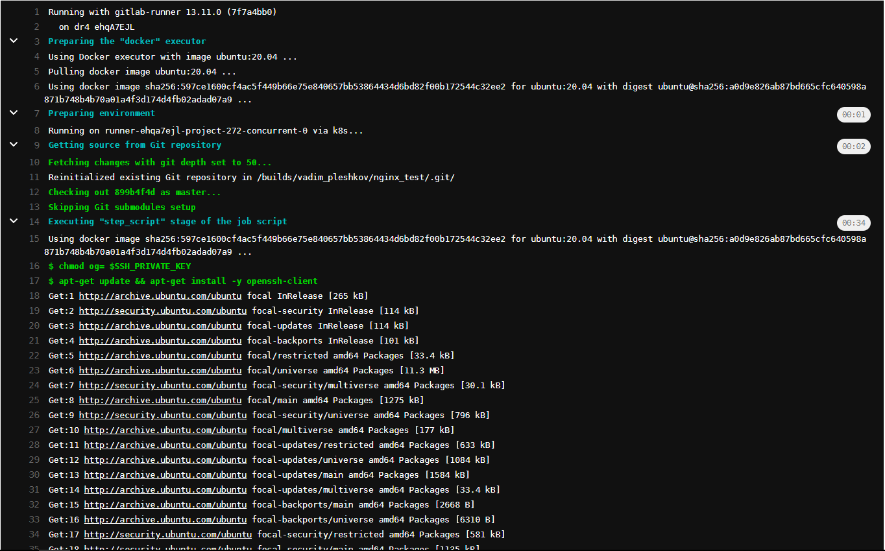
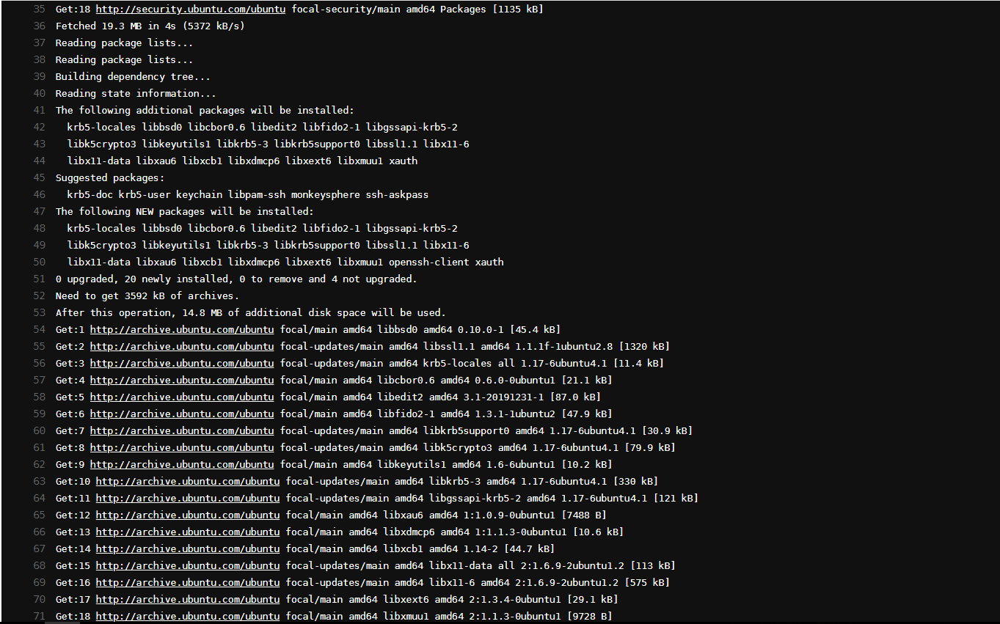
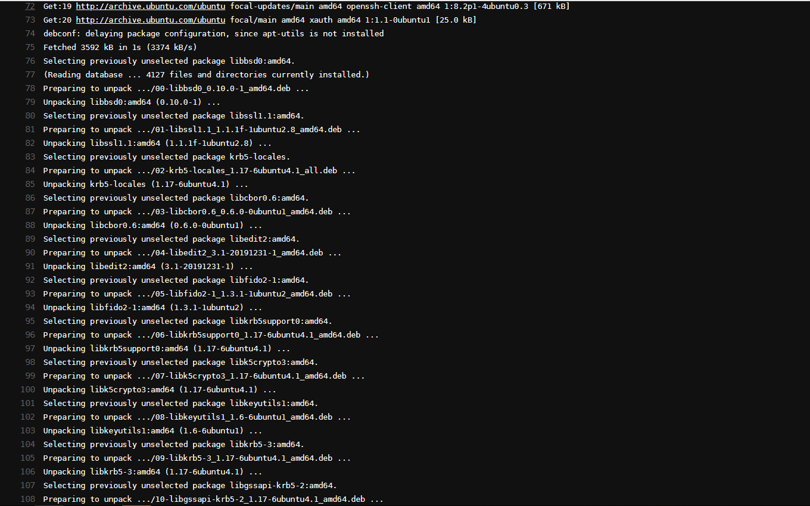
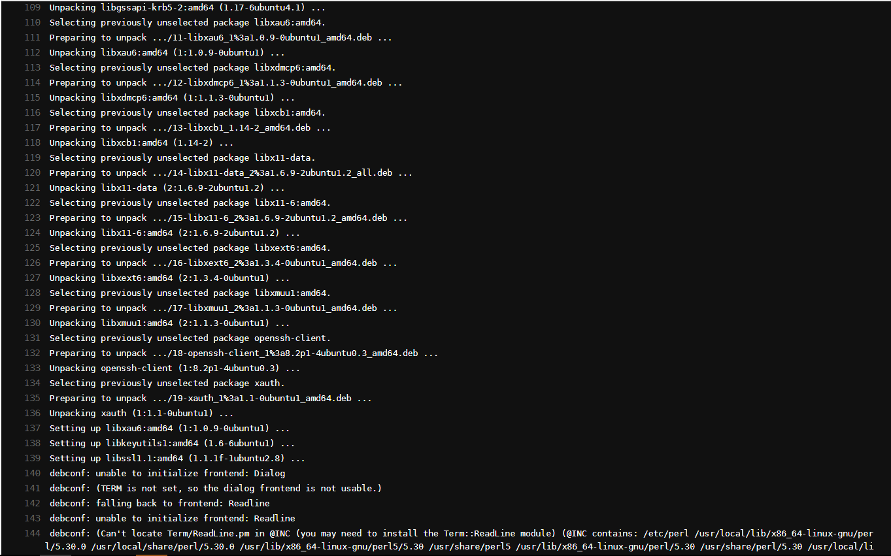
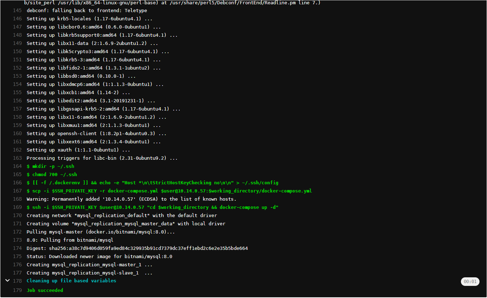
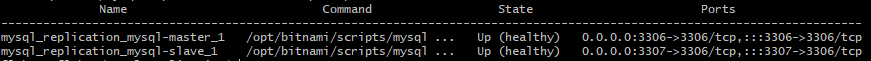
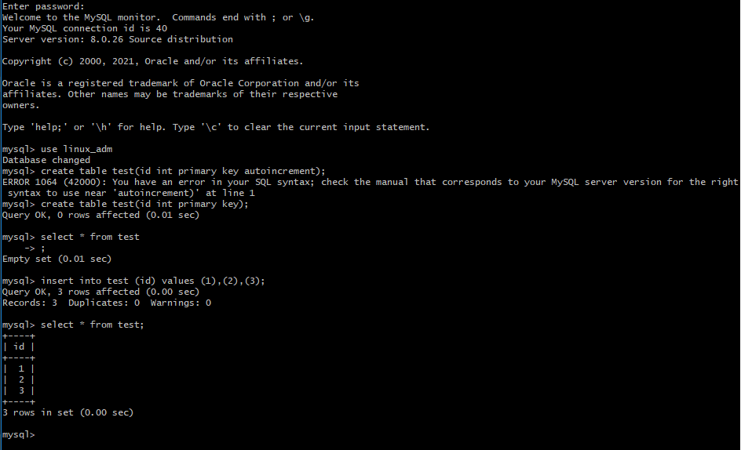
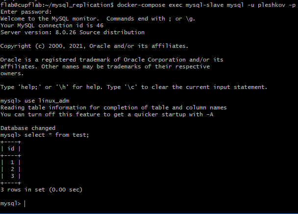

## Условия:
- docker, docker-compose
- gitlab runner

## Конфиг:

yaml-файл конфигурации Gitlab CI/CD (SSH_PRIVATE_KEY указан в gitlab variables):
[.gitlab-ci.yml](.gitlab-ci.yml)

docker-compose файл для mysql (bitnami):
[docker-compose.yml](docker-compose.yml)

## Шаги:

- Запуск pipeline и его выполнение:

- Проверка статуса контейнеров:

- Доступ к БД с master:

- Репликация данных на slave:

