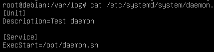

``Theory:
``
1. Назовите основные отличия и преимущества systemd от sysvinit, опишите подходы.
```
  1.1 sysvinit запускает процессы последовательно исходя из фазы загрузки, а systemd сначала исполняет default.target, а затем строит дерево зависимостей
  1.2 systemd поддерживает активацию сервисов на основе сокетов
  1.3 в sysvinit система runlevel, в systemd target
 ```
2. Каким образом происходит параллельный запуск всех процессов но в то же время сервисы стартуют с нужными зависимостями друг относительно друга
```
 2.1 systemd по построенному дереву зависимостей понимает необходимые для запуска демона сервисы и запускает их параллельно. Также systemd позволяет заранее создать сокет для сервиса
 ```
3. каким образом проверить работает процесс в sysvinit и в systemd?

 - sysvinit:
 ```bash
  $ chkconfig service_name
 ```
 - systemd:
 ```bash
  $ systemctl status unit
 ```
4. Как добавить в автозагрузку init скрипт в sysvinit и в systemd?
 - sysvinit: добавить скрипт в директорию /etc/init.d и выполнить команду 
 ```bash
  $ chkconfig service_name on
 ```
 - systemd: добавить файл с описанием в /etc/systemd/system и выполнить команду
 ```bash
  $ systemctl enable service_name
 ```
5. Как посмотреть логи в системе systemd по нужному нам процесс
 ```bash
 $ journalctl -u service_name
 ```

``Practice:
``
1. написать простой скрипт на любом языке программирования который будет работать в режиме демона
 - /opt/daemon.sh

 ```bash
 #!/bin/bash

 while :
 do
   echo `date` > /var/log/script.log
   sleep 5m
 done
 ```

2. установить дистрибутив Debian 8 и написать sysvnit скрипт для запуска процесса, добавить в автозагрузку, проверить автозагрузку и работу start stop 
аргументов
 - /etc/init.d/daemon.sh


 ```bash
  $ update-rc.d daemon.sh start
 ```


3. Установить Debian 10, написать systemd unit, ш в автозагрузку, проверить что скрипт запускается после рестарта, проверить start stop status unit-а

 - /etc/systemd/system/daemon.service:




4. написать timer для systemd который раз в 5 минут пишет что-либо в лог файл


